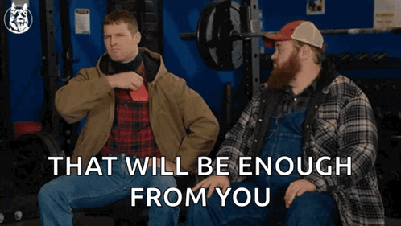

# The "Be Excellent To Each Other! Party On Dudes!" (BETEO!POD!) Code of Conduct


-------------
First thing first here is a copy of the most important part of the document, which is usually put at the end for whatever silly reason!

If you're experiencing online harassment or bullying and need additional support, please consider looking at this site which is an international repository of helplines by clicking the "details" dropdown just bellow:
<details>

**WARNING: YOU WILL NOTICE THAT THE LINKS DO NOT WORK, THIS IS BY DESIGN! IF YOU NEED HELP COPY THE LINKS, OPEN AN UNASSUMING TAB IN THIS WINDOW, THEN OPEN A PRIVATE WINDOW AND PASTE THE SITES YOU'VE COPIED!**

<a href=".">https://findahelpline.com/</a> : This is an **INTERNATIONAL** site.

<a href=".">https://www.reddit.com/r/TalkTherapy/wiki/crisisresources/</a> : This is a reddit post with many resources as well.
</details>

Now the slightly less important
-------------
# Our Values
Here are the core values that should be respected! They are pretty neat if you ask me! It's not super long, and pretty easy to understand. (HOPEFULY! O_O )

## Embracing snowflakes, but also... not... snowflakes?...:
We recognize that everyone has their own unique sensitivities, boundaries, and needs. It's okay to be a snowflake – in fact, it's more than okay; it's human. And if someone is not a snowflake, a ...rock... flake, per-say, that person should not be dehumanised for having thicker skin!

## Respectful accommodations:
While we can't cater to every individual's needs all the time, we strive to be understanding and accommodating when possible. If you're a snowflake, we'll try our best to respect your boundaries and make you feel comfortable – but also remember that others may not share your sensitivities.

## Life is grey, not black and white:
We find that this quote is a perfect analogy for the complexities of life. Like pixels on a black-and-white screen, there are truths out there that exist. These are the black and white pixels, like math, and physics, we have to really zoom-in to see these truths. But when you see the bigger picture, everything just seems uniformely grey! (or *gray*, whatever!)- If anyone insults someone in a hateful manner(racism, anti-Semitism, homophobic, or any other hateful comment), the person who is  receiving the insult will decide the fate the person insulting as the maintain In this case the three-strike rule can be ignored. The reason for this is that certain people will say these derogatory comments in sarcastic manner(as to laugh at the absurdity of the statement) some people from the targeted demographics might catch on when this happens. No one will be allowed to complain about someone feeling a statement goes to far EVEN AS A JOKE, even if said person is not the one receiving the (perhaps) "joke" as for certain people "jokes" like these will "hit to close to home" as many humans tend to be complete idiots.(Bigotry is idiotic) So we shouldn't expect people to just "get the joke." In the case where this escalates and the user insulted is not available for whatever reason, the comment will be automatically deleted as promptly as possible.

## Brazil
🇧🇷 mentioned.

## Humanity over ego:
We prioritize being kind, empathetic, and understanding over being "right" or winning arguments. Remember, we're all in this together!

**THAT BEING SAID:** Someone *can* be right about something, and people should be ok being wrong. If someone has a hard time seeing that they are wrong, it is the responsability of the people who are right to not be "dinguses" about it.

## Red Card, Yellow Card:
Here's an exerpt of a group of fellas I like and I think they got a pretty good system:
```
‐ Wanna know what? Soccer's got a pretty good thing going with that card system, eh?

‐ The which?
‐ For the referees?

‐ Yeah. Like, if someone's being a dink, you give 'em a yellow card. It's like a warning card. Then if they keep being a tit, you give 'em a red card which means that tit's out.

‐ Mm.
‐ Out where?

‐ Like, out of the game. Like, you don't gotta deal with 'em anymore.

‐ Well, that's handy then.

‐ That's Handy Moore.

‐ It'd be Handy Orton.

‐ Could be Handy Roddick.

‐ It's Handy Patinkin.

‐ Well, how handy would that be if it was real life?

‐ Well, no doubt that'd be handy.

‐ It'd be Handy Newton.

‐ It'd be Handy Koufax.

‐ It'd be Handy Alomar Jr.

‐ It'd be Macho Man Handy Savage.

‐ It's like, we could weed out the tits, it'll give us more time for real people. What's the problems?

‐ Well, yeah. And then we wouldn't have to deal with the tits.

‐ Yeah, yeah. So if ya gets a yellow card, it means stops being a dinks. And if you keeps being a dinks, you gets a red card which means you're out, ya tit!
```

This will be implemented. You get one warning, you know, you can make mistakes. But if you start being "a dink..." well, you know the rest.

--------------------
# Expected Behavior


Here's how we expect people to act. It's kinda depressing that this has to be stated in the first place but oh well! Usually breaking the behaviours bellow are "yellow-card" worthy if done more than once, unless mentioned. Speaking of:

## Use humor responsibly:
If you're about to share something that could be considered hurtful as a joke, **prefix** your comment with "/s" (short for "sarcasm" or " warning: snarky remark ahead") so others know to take it lightly. This helps us avoid misunderstandings and keeps the vibes light. **YOU MUST PUT IT AT THE BEGINNING OF YOUR COMMENT. Or else someone might read it and be triggered UNTILL they see the "/s" in which case they HAVE already been triggered, and it kind of defeats the point of this rule.**

**Putting "/s" at the end is an automatic yellow card since you didn't bother reading this fun document I put so much prompt-I mean EFFORT into!**

## Be kind and respectful:
Treat others with empathy and understanding, even if you disagree with them. Avoid personal attacks, insults, or condescending language.

## Communicate openly and honestly:
Share your thoughts and feelings in a clear and respectful manner. Listen actively to others and try to understand their perspectives.

## Respect boundaries:
If someone expresses discomfort or asks for space, respect their wishes and give them room to breathe.

## Don't take yourself too seriously:
We're all human, and we all make mistakes. Learn to laugh at yourself and don't be afraid to admit when you're wrong.

## Engage in good-faith discussions:
Come to conversations with an open mind and a willingness to learn. Avoid trolling, baiting, or deliberately trying to provoke others.

Some additional notes on what this means in practice:
```
- If someone asks for a trigger warning(TW) or a content warning(CW) on a thread, please provide one if you're sharing potentially sensitive material. We will *try* making a tag for it, but it could be possible that, in a large thread, that some people might not see the TW/CW. Remember some people might just jump to a comment due to search engines.

- Try to avoid using language that might be hurtful or alienating to others, even if it's not intended that way. We're all coming from different places and experiences! If you do please tag it properly!

- If you see someone being bullied or harassed, speak up and support them! Or ask in the thread if that interaction was ok. We're a community, and we look out for each other, and if we do this long enough some might learn what jokes pass and what don't. It's a skill like any other after all!
```

----------------------
# Unacceptable Behavior
\s Tits out!(Did you know they are a type of chickadee?)



## Hateful speech:
Any form of hateful or discriminatory speech, including racism, anti-Semitism, homophobia, or other forms of targeted harassment, will not be tolerated.

### But what if "/s?"
Listen I love making fun of biggotry, it's so incredibly dumb that I can never imagine anyone saying something *actually* biggoted... **SADDLY THOUGH**, some people like to ruin my fun by being serious about it... so if biggotry happens, even with "/s":
```
Then the person(**OR GROUP**) receiving the insult will have a significant say in determining the fate of the person responsible. This means that they have the power of the Red Card, or Yellow Card if they feel merciful! To elaborate:
```
### Context and Intent are Not Excuses; they are Explanations, but not Excuses:
So to contextualize the header above: **An Excuse** is when you try to move the responsibility of your action to something else, in some cases this is valid. Like when you were late to work because your car exploded, that's a good excuse! **An Explanation** on the other hand, explains your behaviour(duh), but the resposibility is still on you. For example: I really like messed up humour! I have probably done my fair share of horrible jokes, but I do them with people that I know won't be affected by them. But I don't use this as an excuse if someone hears me say that and feels offended! If you say/do something that could be considered terrible by someone, YOU MUST ACCEPT THAT RISK AND THE RESPOSIBILITY THAT COMES WITH IT!

### Said more professionaly...

We understand that some individuals may attempt to use sarcasm or humor as an excuse for hateful speech. However, we also recognize that certain comments can have a significant impact on members of targeted demographics, even if they're intended as jokes. As such, we will not tolerate complaints about people feeling that a statement has gone too far, even if the complainant is not the one being targeted.

## Automatic Deletion
In cases where an insult or hateful comment is reported and the person who was targeted is unavailable to respond, the comment will be automatically deleted as promptly as possible.

Some additional notes on what this means in practice:

```
- Our community is built on a foundation of respect and empathy. We expect all members to uphold these values and treat each other with kindness and compassion.

- If you witness hateful speech or targeted harassment, please report it immediately to the moderators.

- Remember that everyone has different boundaries and triggers. Be considerate of others' feelings and avoid making jokes or comments that could be hurtful or alienating.
```

---------------------
# Reporting Incidents

If you witness or experience any form of unacceptable behavior, including hateful speech, targeted harassment, or other forms of bullying or abuse, please report it to our moderators immediately.

How to Report an Incident

To report an incident, please follow these steps:

```
Gather information: Take note of the date, time, and location (including any relevant links or screenshots) where the incident occurred.

Contact a moderator: Reach out to one of our moderators via private message or email (insert contact information). Be sure to include as much detail as possible about the incident.

Provide context: Share any relevant background information that may help us understand the situation better.
``

What to Expect After Reporting an Incident

After reporting an incident, you can expect:

``
Prompt response: Our moderators will respond to your report within [insert timeframe, e.g., 24 hours].

Confidentiality: We will keep your identity confidential unless you explicitly give us permission to share it.

Action taken: Depending on the severity of the incident, we may take disciplinary action against the person responsible, including temporary or permanent bans from our community.

```
## Additional Resources

If you're experiencing online harassment or bullying and need additional support, please consider looking at this site which is an international repository of helplines by clicking the "details" section just bellow:
<details>

**WARNING: YOU WILL NOTICE THAT THE LINKS DO NOT WORK, THIS IS BY DESIGN! IF YOU NEED HELP COPY THE LINKS, OPEN AN UNASSUMING TAB IN THIS WINDOW, THEN OPEN A PRIVATE WINDOW AND PASTE THE SITES YOU'VE COPIED!**

<a href=".">https://findahelpline.com/</a> : **There is a "Quick Exit" button at the top of the page in case you need to exit the page quickly, if your internet connection is slow, closing the window is faster! I've tried.**

<a href=".">https://www.reddit.com/r/TalkTherapy/wiki/crisisresources/</a> : This is a reddit post with many resources as well.
</details>

Remember that your safety and well-being are important to us. If we are going to take some risks by being a bit more leanient with jokes then we should also take the time to help people what are in difficult situations. As a community we should be here to help and want to ensure that our community remains a welcoming and inclusive space for everyone.

Please note that this is just a draft, and you may need to adjust it according to your specific community's needs and policies.

--------------------------------------
# Consequences of Unacceptable Behavior

* Describe the consequences for engaging in unacceptable behavior, such as:
	+ Warnings or temporary bans
	+ Permanent ban from the community

----------------------
# Changes and Updates

* Explain how changes will be made to this Code of Conduct, including:
	+ Who is responsible for reviewing and updating the document
	+ How updates will be communicated to the community

Now it's your turn! Please guide me through filling in each section.