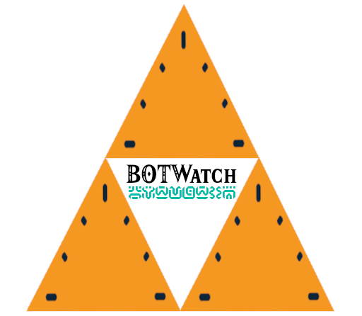

# BOTWatch



Do you like Zelda from the Legend Of Zelda: Breath Of The Wild? I do to, I wish I could run and scale mountains like he does!

Great, now that I have caught you're attention with that first sentence and triggered you with the blatantly silly gramatical mistake in this sentence: this is an open-source firmware for the [PineTime smartwatch](https://www.pine64.org/pinetime/) with many features, written in "modern-ish" C++. A fork of the Popular [Infinitime](https://github.com/InfiniTimeOrg/InfiniTime) firmware that runs on the PineWatch. Forked from version 1.14.

**NOTE TO THE READER: In order to get people to read documentation, I like to add a bit of humour and flair to my docs. This should be addressed in the [CODE_OF_CONDUCT](./CODE_OF_CONDUCT.md) file that will be included if it isn't already**

**MINI CODE OF CONDUCT(TW(Trigger Warning)): In the documentation I like to joke at the expense of the reader, it keeps them on their toes, and makes the reading entertaining! That being said, if you are one to be easily triggered, that is OK, not everyone has the same sensibilities. If, say, "userA" has issues with an other user("userB") being insulted by a joke, "userA" will be the one told to "chill out." (That's right _userA_)**

## "Why not add this as a watchface to Infinitime?"
So there are many reasons for this, some of them good!
1. In order to get certain things working, I've had to change some LVGL configurations.
1. I got rid of the filesystem functionality. Since I want most images to be loaded at runtime.
   * This was done to improve performance, since I wanted to have something that felt like you were in the BOTW game.
1. Performance/Battery life: The watchface has some more complicated things to draw than the original firmware, this means RAM is almost all taken, which in turn will lower the battery life by quite a bit.
   * Like battery life is about two days rather than the usual 4-5 days the original firmware will do.

## New to InfiniTime?

- [Getting started with InfiniTime](doc/gettingStarted/gettingStarted-1.0.md)
- [Updating the software](doc/gettingStarted/updating-software.md)
- [About the firmware and bootloader](doc/gettingStarted/about-software.md)
- [PineTimeStyle Watch face](https://wiki.pine64.org/wiki/PineTimeStyle)
  - [Weather integration](https://wiki.pine64.org/wiki/Infinitime-Weather)

### Companion apps

- [Gadgetbridge](https://gadgetbridge.org/) (Android)
- [AmazFish](https://openrepos.net/content/piggz/amazfish/) (SailfishOS)
- [Siglo](https://github.com/alexr4535/siglo) (Linux)
- [InfiniLink](https://github.com/InfiniTimeOrg/InfiniLink) (iOS)
- [ITD](https://gitea.elara.ws/Elara6331/itd) (Linux)
- [WatchMate](https://github.com/azymohliad/watchmate) (Linux)

***Note**: We removed mentions to NRFConnect as this app is closed source and recent versions do not work anymore with InfiniTime (the last version known to work is 4.24.3). If you used NRFConnect in the past, we recommend you switch to [Gadgetbridge](https://gadgetbridge.org/).*

## Development

- [InfiniTime Vision](doc/InfiniTimeVision.md)
- [Rough structure of the code](doc/code/Intro.md)
- [How to implement an application](doc/code/Apps.md)
- [Generate the fonts and symbols](src/displayapp/fonts/README.md)
- [Tips on designing an app UI](doc/ui_guidelines.md)
- [Bootloader, OTA and DFU](bootloader/README.md)
- [External resources](doc/ExternalResources.md)

### Contributing

- [How to contribute?](CONTRIBUTING.md)
- [Coding conventions](doc/coding-convention.md)

### Build, flash and debug

- [InfiniTime simulator](https://github.com/InfiniTimeOrg/InfiniSim)
- [Build the project](doc/buildAndProgram.md)
- [Build the project with Docker](doc/buildWithDocker.md)
- [Build the project with VSCode](doc/buildWithVScode.md)
- [Flash the firmware using OpenOCD and STLinkV2](doc/openOCD.md)
- [Flash the firmware using SWD interface](doc/SWD.md)
- [Flash the firmware using JLink](doc/jlink.md)
- [Flash the firmware using GDB](doc/gdb.md)
- [Stub using NRF52-DK](doc/PinetimeStubWithNrf52DK.md)

### API

- [BLE implementation and API](doc/ble.md)

### Architecture and technical topics

- [Memory analysis](doc/MemoryAnalysis.md)

### Project management

- [Maintainer's guide](doc/maintainer-guide.md)
- [Versioning](doc/versioning.md)
- [Project branches](doc/branches.md)
- [Files included in the release notes](doc/filesInReleaseNotes.md)
- [Files needed by the factory](doc/files-needed-by-factory.md)

## Licenses

This project is released under the GNU General Public License version 3 or, at your option, any later version.

It integrates the following projects:

- RTOS: **[FreeRTOS](https://freertos.org)** under the MIT license
- UI: **[LittleVGL/LVGL](https://lvgl.io/)** under the MIT license
- BLE stack: **[NimBLE](https://github.com/apache/mynewt-nimble)** under the Apache 2.0 license
- Font: **[Jetbrains Mono](https://www.jetbrains.com/fr-fr/lp/mono/)** under the Apache 2.0 license

## Credits
So since this project is mostly based on the pinetime(InfiniTime) community, most of the credit goes to them. However there is are two projects that have inspired me to start this project, so go give them some love!
1. **BOTWatchy(The original inspiration!):** https://github.com/mehtmehtsen/BotWatchy
1. **@hparamore's Zelda BOTW UI Kit(Where I got some assets from!):** https://www.figma.com/community/file/965825767811358609/zelda-botw-ui-kit
1. **Zelda Universe(Where I got the fonts for this project):** https://zeldauniverse.net/media/fonts/

```
I’m not working alone on this project. First, many people create pull requests for this project. Then, there is the whole #pinetime community: a lot of people all around the world who are hacking, searching, experimenting and programming the Pinetime. We exchange our ideas, experiments and code in the chat rooms and forums.

Here are some people I would like to highlight:

- [Atc1441](https://github.com/atc1441/): He works on an Arduino based firmware for the Pinetime and many other smartwatches based on similar hardware. He was of great help when I was implementing support for the BMA421 motion sensor and I²C driver.
- [Koen](https://github.com/bosmoment): He’s working on a firmware based on RiotOS. He integrated similar libs as me: NimBLE, LittleVGL,… His help was invaluable too!
- [Lup Yuen Lee](https://github.com/lupyuen): He is everywhere: he works on a Rust firmware, builds a MCUBoot based bootloader for the Pinetime, designs a Flutter based companion app for smartphones and writes a lot of articles about the Pinetime!
```